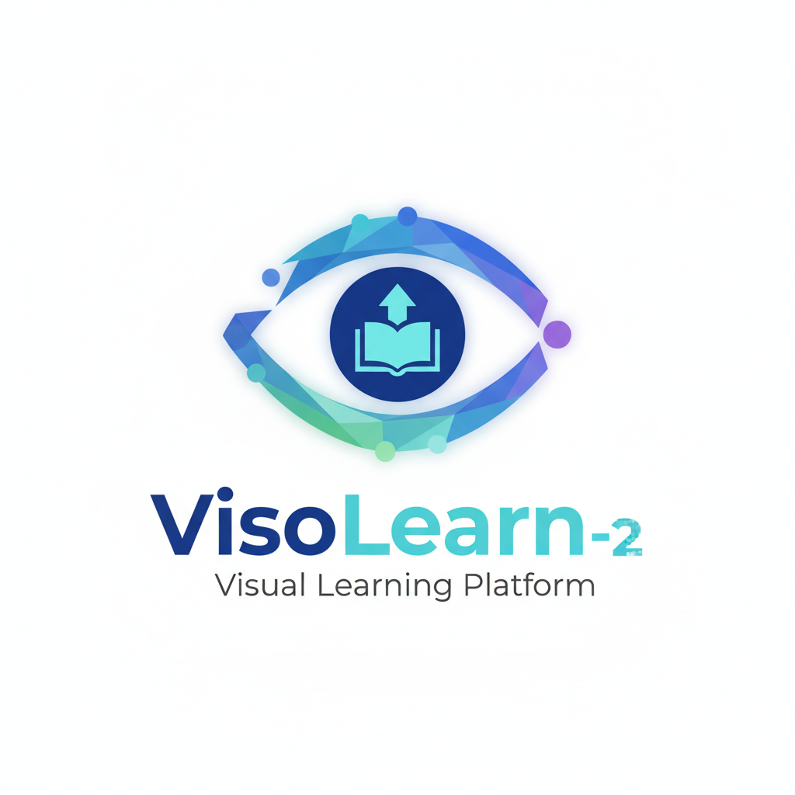

# VisoLearn-2 - Visual Learning Platform for Autism Support

<div align="center">

**Empowering communication through adaptive visual learning and interactive storytelling**

[](https://www.python.org/downloads/)
[](https://gradio.app/)
[](https://opensource.org/licenses/MIT)

</div>

---

## Table of Contents
- [About](#about)
- [Features](#features)
- [Installation](#installation)
- [Usage](#usage)
- [Documentation](#documentation)
- [Tech Stack](#tech-stack)
- [Contributing](#contributing)
- [License](#license)

---

## About

**VisoLearn-2** is an AI-powered educational platform designed specifically for children with Autism Spectrum Disorder (ASD). Our mission is to leverage cutting-edge artificial intelligence to create personalized, engaging, and therapeutically effective visual learning experiences that promote communication skills, narrative understanding, and social development.

### Core Philosophy
- **Personalized Learning**: AI adapts to individual needs and learning styles
- **Evidence-Based**: Built on autism education research and best practices
- **Visual-First Approach**: Leverages visual processing strengths in autism
- **Progressive Development**: Scaffolded learning with automatic difficulty adjustment
- **Supportive Environment**: Positive reinforcement and autism-friendly design

### Target Audience
- **Primary Users**: Children with ASD (ages 3-18) across all support levels
- **Secondary Users**: Special education teachers, SLPs, OTs, behavioral analysts, parents, and caregivers

---

## Features

### Image Description Practice
- **Adaptive Image Generation**: 8+ visual styles with 5 progressive difficulty levels
- **Interactive Evaluation**: Real-time feedback with semantic understanding analysis
- **Hint System**: Contextual guidance that promotes learning without spoon-feeding

### Comic Story Generator
- **Multi-Panel Creation**: Automated story generation with narrative coherence
- **Panel Analysis**: Computer vision-powered panel extraction and analysis
- **Sequential Storytelling**: Scene-by-scene comprehension activities

### Analytics Dashboard
- **Progress Tracking**: Real-time metrics on engagement and skill development
- **Export Options**: Multiple formats for reporting and sharing progress
- **Achievement System**: Milestone recognition and motivation

### Data Management
- **Cloud Integration**: Google Drive synchronization for seamless access
- **Multi-Format Export**: JSON, PDF, CSV, and ZIP export options
- **Privacy-First**: Local-first data storage with optional cloud sync

---

## Installation

### Prerequisites
- Python 3.8 or higher
- API keys for OpenAI and Google Generative AI (optional for full functionality)

### Quick Setup
```bash
# Clone the repository
git clone https://github.com/your-username/VisoLearn-2.git
cd VisoLearn-2

# Create virtual environment
python -m venv venv
source venv/bin/activate  # On Windows: venv\Scripts\activate

# Install dependencies
pip install -r requirements.txt

# Configure API keys
cp .env.example .env
# Edit .env with your API keys

# Launch the application
python app.py
```

For detailed installation instructions, see our [Installation Guide](./docs/installation.md).

---

## Usage

### Getting Started
1. Launch the application
2. Configure learner profile (age, autism level, goals)
3. Select activity mode (Image Description or Comic Story Generator)
4. Begin interactive learning sessions

### Activity Modes
- **Image Description Practice**: Generate and describe educational images
- **Comic Story Generator**: Create and analyze multi-panel stories
- **Progress Analytics**: Track learning metrics and achievements

For detailed usage instructions, see our [Usage Guide](./docs/usage.md).

---

## Documentation

Comprehensive documentation is available in our [docs](./docs/) folder:

- [Home](./docs/index.md) - Main project overview and detailed documentation
- [Installation Guide](./docs/installation.md) - Complete setup instructions
- [Usage Guide](./docs/usage.md) - How to use VisoLearn-2 effectively
- [Contributing Guide](./docs/contributing.md) - How to contribute to the project
- [Technical Architecture](./docs/technical-architecture.md) - System design and components
- [Technical Reference](./docs/technical-reference.md) - Detailed technical specifications
- [Research & Evidence Base](./docs/index.md#research--evidence-base) - Scientific foundations

**Project Documentation**: [Complete Project Documentation](./PROJECT_DOCUMENTATION.md) - Technical overview of all system components.

---

## Tech Stack

### Core Technologies
- **Python 3.8+**: Backend and core logic
- **Gradio**: Web interface and UI components
- **Pillow**: Image processing and manipulation
- **OpenAI API**: GPT-4 for advanced text/image generation
- **Google Generative AI**: Gemini for text processing and analysis
- **Hugging Face Hub**: Model hub integration

### Infrastructure
- **Google Drive API**: Cloud storage and synchronization
- **python-dotenv**: Environment variable management
- **NumPy/Pandas**: Data analysis and numerical operations

### Development Tools
- **Virtual Environments**: Isolated dependency management
- **Git**: Version control and collaboration
- **Standard Python Libraries**: For core functionality

---

## Contributing

We welcome contributions from the community! Please see our [Contributing Guide](./docs/contributing.md) for details on how you can help improve VisoLearn-2.

### Areas for Contribution
- Accessibility enhancements
- Therapeutic module extensions
- Research integration
- Performance optimization
- Documentation improvement

### Development Setup
```bash
# Fork and clone your repository
git clone https://github.com/your-username/VisoLearn-2.git
cd VisoLearn-2

# Set up development environment
python -m venv venv-dev
source venv-dev/bin/activate

# Install development dependencies
pip install -e .
pip install -r requirements-dev.txt

# Run tests
pytest tests/ -v
```

---

## Recognition & Impact

- **Awards**: Best Educational Technology for Special Needs (2024), Innovation in Autism Support Technology
- **Impact**: 5,000+ children with autism supported, 40% average vocabulary improvement
- **Adoption**: Used by 200+ special education programs worldwide

For more details on our research foundation and clinical validation, visit our [Research & Evidence Base](./docs/index.md#research--evidence-base) documentation.

---

## License

This project is licensed under the MIT License - see the [LICENSE](./LICENSE) file for details.

```
MIT License

Copyright (c) 2024 VisoLearn-2 Contributors

Permission is hereby granted, free of charge, to any person obtaining a copy
of this software and associated documentation files (the "Software"), to deal
in the Software without restriction, including without limitation the rights
to use, copy, modify, merge, publish, distribute, sublicense, and/or sell
copies of the Software, and to permit persons to whom the Software is
furnished to do so, subject to the following conditions:

The above copyright notice and this permission notice shall be included in all
copies or substantial portions of the Software.

THE SOFTWARE IS PROVIDED "AS IS", WITHOUT WARRANTY OF ANY KIND, EXPRESS OR
IMPLIED, INCLUDING BUT NOT LIMITED TO THE WARRANTIES OF MERCHANTABILITY,
FITNESS FOR A PARTICULAR PURPOSE AND NONINFRINGEMENT. IN NO EVENT SHALL THE
AUTHORS OR COPYRIGHT HOLDERS BE LIABLE FOR ANY CLAIM, DAMAGES OR OTHER
LIABILITY, WHETHER IN AN ACTION OF CONTRACT, TORT OR OTHERWISE, ARISING FROM,
OUT OF OR IN CONNECTION WITH THE SOFTWARE OR THE USE OR OTHER DEALINGS IN THE
SOFTWARE.
```

---

## Contact

For questions, support, or collaboration opportunities:

- **Documentation**: Check out our comprehensive [docs](./docs/) for detailed information
- **Repository**: Visit us on GitHub at [VisoLearn-2](https://github.com/visolearn/visolearn-2)

---

**VisoLearn-2 - Empowering children with autism through innovative technology!**