# 🏗️ Technical Architecture

## 🎯 System Overview

```
┌─────────────────────────────────────────────────────────────┐
│                    VisoLearn-2 Architecture                 │
├─────────────────────────────────────────────────────────────┤
│  🎨 Frontend Layer (Gradio + Custom CSS/JS)                 │
│  ├── 🖼️ Image Description Interface                         │
│  ├── 📖 Comic Story Generator Interface                     │
│  ├── 📊 Analytics Dashboard                                 │
│  └── ⚙️ Settings & Configuration                            │
├─────────────────────────────────────────────────────────────┤
│  🤖 Application Layer (Python)                              │
│  ├── 📁 Session Management                                  │
│  ├── 🔄 State Management                                    │
│  ├── 💾 File Operations                                     │
│  └── 📈 Visualization Utils                                 │
├─────────────────────────────────────────────────────────────┤
│  🧠 AI Integration Layer                                     │
│  ├── 🖼️ Google Imagen 4.0 Ultra (Image Generation)         │
│  ├── 🤖 Google Gemini 2.5 Flash (Multimodal Analysis)      │
│  ├── 📊 Custom Evaluation Engine                           │
│  └── 📖 Story Generation Pipeline                          │
├─────────────────────────────────────────────────────────────┤
│  👁️ Computer Vision Layer                                  │
│  ├── 📊 OpenCV Panel Detection                             │
│  ├── 🖼️ Image Processing (PIL/Pillow)                      │
│  ├── ✅ Quality Assessment                                 │
│  └── 📐 Layout Optimization                                │
├─────────────────────────────────────────────────────────────┤
│  💾 Data Layer                                              │
│  ├── 📁 Local File System                                  │
│  ├── ☁️ Google Drive API                                   │
│  ├── 🔄 Session Persistence                                │
│  └── 📊 Analytics Storage                                  │
└─────────────────────────────────────────────────────────────┘
```

## 🎨 User Interface Architecture

### Gradio-Based Web Interface

**Main Components:**
- **Logo Header**: Branding and visual identity
- **Session Management Tabs**: Browser storage and filesystem operations
- **Image Generation Panel**: Parameter input and image creation
- **Description Practice Interface**: Chatbot-style interaction
- **Progress Tracking Dashboard**: Real-time metrics and visualizations
- **Data Export Options**: Multiple format support

**Key UI Modules:**
```python
def create_interface():
    """
    Main interface creation function using Gradio Blocks.
    Organizes UI into logical sections with proper state management.
    """
    with gr.Blocks(css=custom_css) as demo:
        # State management
        active_session = gr.State(DEFAULT_SESSION)
        saved_sessions = gr.State([])
        checklist_state = gr.State([])

        # Logo and branding
        with gr.Row(elem_id="logo-row"):
            gr.Image(value=logo_path, show_label=False)

        # Main content area
        with gr.Row():
            # Left column: Session management and generation
            with gr.Column(scale=2):
                session_management_tabs()
                image_generation_panel()
                description_practice_interface()

            # Right column: Progress tracking
            with gr.Column(scale=1):
                progress_dashboard()
                data_export_options()

        # Event handlers and interactions
        setup_event_handlers(demo)

    return demo
```

**Session Management System:**
- **Browser Storage**: Client-side persistence using localStorage
- **Filesystem Storage**: Server-side file operations
- **State Synchronization**: Cross-device session continuity
- **Backup & Recovery**: Automatic data preservation

**Interactive Elements:**
- **Dynamic Checklists**: Real-time detail identification tracking
- **Progress Visualizations**: Charts and achievement indicators
- **Chat Interface**: Natural conversation flow with AI evaluation
- **Export Capabilities**: JSON, PDF, CSV, and image formats

### 🔁 Data Flow

```
User Input → AI Processing → Image Generation → User Interaction →
Evaluation → Feedback → Progress Tracking → Analytics
```

## 🧩 Core Technologies

### 🎨 Frontend Technologies

**Gradio 4.x** - Modern web interface framework
- Customizable UI components
- Real-time interaction capabilities
- Built-in authentication support

**Custom CSS3** - Advanced styling with autism-friendly design patterns
- High-contrast color schemes
- Reduced visual clutter
- Consistent layout patterns
- Responsive typography

**JavaScript ES6+** - Enhanced interactivity and real-time updates
- Dynamic content loading
- Real-time feedback display
- Interactive analytics visualizations
- Form validation and input handling

**Responsive Design** - Mobile and tablet compatibility
- Adaptive layouts for all screen sizes
- Touch-friendly interface elements
- Cross-browser compatibility
- Accessibility features

### 🤖 Backend Technologies

**Python 3.8+** - Core application development
- Object-oriented design patterns
- Modular architecture
- Type hints for better code quality
- Comprehensive error handling

**FastAPI Integration** - High-performance API endpoints
- RESTful API design
- Automatic OpenAPI documentation
- Asynchronous request handling
- Dependency injection system

**Asyncio** - Asynchronous processing for improved performance
- Non-blocking I/O operations
- Concurrent AI model calls
- Efficient resource utilization
- Scalable architecture

**Threading** - Parallel processing for AI model calls
- Multi-threaded image generation
- Concurrent evaluation processing
- Background task management
- Resource optimization

### 🧠 AI & Machine Learning

**Google Gemini 2.5 Flash** - Advanced multimodal AI model
- Vision-language understanding (image analysis and description)
- Text generation and evaluation
- Conceptual understanding assessment
- Educational content processing
- Story generation and comprehension analysis

**Google Imagen 4.0 Ultra** - High-quality image generation
- Photorealistic and artistic image creation
- Educational content generation
- Multi-style support (Realistic, Cartoon, Watercolor, etc.)
- Sequential story visualization
- Autism-friendly content creation

**Custom Evaluation Engine** - Specialized assessment algorithms
- Autism-specific evaluation metrics
- Progress tracking algorithms
- Adaptive difficulty adjustment
- Therapeutic goal alignment

### 👁️ Computer Vision Stack

**OpenCV 4.x** - Advanced image processing and panel detection
- Image analysis and manipulation
- Panel boundary detection
- Quality assessment algorithms
- Layout optimization tools

**PIL/Pillow** - Image manipulation and format conversion
- Multi-format image support
- Image transformation utilities
- Color space conversions
- Metadata handling

**NumPy** - Numerical computing for image arrays
- Efficient array operations
- Mathematical transformations
- Statistical analysis
- Performance optimization

**Scikit-Image** - Additional image processing algorithms
- Advanced filtering techniques
- Feature detection algorithms
- Image enhancement tools
- Computer vision utilities

## 🔄 Data Flow Architecture

### 🖼️ Image Description Practice Flow

```mermaid
graph TD
    A[👤 User Input: Age, Autism Level, Topic] --> B[📝 Prompt Generation Engine]
    B --> C[🖼️ Google Imagen Image Generation]
    C --> D[✅ Image Quality Validation]
    D --> E[🔍 Detail Extraction Engine]
    E --> F[🖼️ Display to User]
    F --> G[💬 User Description Input]
    G --> H[🧠 Gemini Evaluation Engine]
    H --> I[📊 Feedback Generation]
    I --> J[📈 Progress Update]
    J --> K{🔄 Advancement Check}
    K -->|Yes| L[🆕 New Image Generation]
    K -->|No| M[🔄 Continue Current Level]
    L --> B
    M --> F
```



**Detailed Process:**

1. **User Input Collection**: Age, autism level, topic preferences
2. **Prompt Generation**: AI-powered prompt creation based on user profile
3. **Image Generation**: Google Imagen 4.0 Ultra creates educational images
4. **Quality Validation**: Automated image quality assessment
5. **Detail Extraction**: Identification of key visual elements
6. **User Interaction**: Image display and description input
7. **Evaluation**: Semantic analysis of user descriptions
8. **Feedback**: Constructive, encouraging responses
9. **Progress Tracking**: Skill development monitoring
10. **Difficulty Adjustment**: Automatic level progression

### 📖 Comic Story Generation Flow

```mermaid
graph TD
    A[📝 User Story Concept] --> B[🤖 Story Enhancement AI]
    B --> C[👥 Multi-Agent Story Generation]
    C --> D[🎭 Character Consistency Check]
    D --> E[🖼️ Panel-by-Panel Image Generation]
    E --> F[📖 Comic Assembly]
    F --> G[🔍 Panel Extraction Pipeline]
    G --> H[✅ Quality Validation]
    H --> I[📺 Interactive Display]
    I --> J[💬 User Analysis Input]
    J --> K[🧠 Comprehension Evaluation]
    K --> L[📚 Educational Feedback]
```



**Detailed Process:**

1. **Concept Input**: User provides story idea and parameters
2. **Story Enhancement**: AI refines narrative structure and content
3. **Multi-Agent Generation**: Collaborative story creation process
4. **Character Consistency**: Ensures visual and narrative continuity
5. **Panel Generation**: Individual image creation for each scene
6. **Comic Assembly**: Layout and formatting of complete comic
7. **Panel Extraction**: Computer vision-based panel separation
8. **Quality Validation**: Readability and visual quality checks
9. **Interactive Display**: User-friendly comic presentation
10. **User Analysis**: Scene-by-scene comprehension activities
11. **Comprehension Evaluation**: Assessment of narrative understanding
12. **Educational Feedback**: Targeted learning suggestions

## 📊 Performance Characteristics

### 📈 System Performance

**Response Times:**
- Image generation: 5-15 seconds (depending on complexity)
- Evaluation processing: 1-3 seconds
- Analytics updates: Real-time
- Interface rendering: <500ms

**Scalability:**
- Supports concurrent users: 10-50 (depending on server resources)
- Session data storage: Optimized for performance
- Cloud synchronization: Background processing
- Resource management: Automatic optimization

### 💾 Resource Utilization

**Memory Usage:**
- Base application: 200-500MB
- With active sessions: 500MB-2GB
- Image processing: Additional 100-300MB per operation

**Storage Requirements:**
- Application files: ~50MB
- Session data: ~1-5MB per session
- Image storage: ~500KB-2MB per image
- Analytics data: ~100KB per session

### 🔒 Security Architecture

**Data Protection:**
- Encrypted API key storage
- Secure authentication mechanisms
- Data validation and sanitization
- Privacy-preserving analytics

**Access Control:**
- Role-based permissions
- Session isolation
- Secure cloud integration
- Audit logging capabilities

## 🧪 Quality Assurance

### 📊 Testing Strategy

**Test Coverage:**
- Unit tests: 85%+ code coverage
- Integration tests: Comprehensive workflow validation
- End-to-end tests: Complete user journey testing
- Performance tests: Load and stress testing

**Test Types:**
- Functional testing: Feature validation
- Regression testing: Change impact assessment
- Usability testing: Autism-friendly interface validation
- Accessibility testing: Compliance verification

### 🔧 Continuous Integration

**CI/CD Pipeline:**
- Automated testing on every commit
- Code quality checks and linting
- Build validation and packaging
- Deployment automation
- Rollback capabilities

## 🎯 Design Patterns

### 🏗️ Architectural Patterns

**Model-View-Controller (MVC):**
- Clear separation of concerns
- Modular component design
- Easy maintenance and extension

**Repository Pattern:**
- Data access abstraction
- Unified interface for data operations
- Testability and mocking support

**Factory Pattern:**
- Object creation management
- Dependency injection support
- Configurable component instantiation

### 🔄 Behavioral Patterns

**Observer Pattern:**
- Event-driven architecture
- Real-time updates and notifications
- Decoupled component communication

**Strategy Pattern:**
- Algorithm interchangeability
- Runtime behavior selection
- Flexible feature implementation

## 📁 Project Structure

```
visolearn-2/
├── docs/                  # Documentation files
├── models/                # Core AI and business logic
│   ├── image_generation.py # Image generation algorithms
│   ├── evaluation.py       # Assessment and feedback systems
│   ├── story_generation.py # Narrative creation pipelines
│   └── ...
├── ui/                    # User interface components
│   └── interface.py       # Main Gradio interface
├── utils/                 # Utility functions and helpers
│   ├── file_operations.py # File management utilities
│   ├── state_management.py # Session state handling
│   └── ...
├── tests/                 # Comprehensive test suite
├── static/                # Static assets
├── config.py              # Configuration management
├── app.py                 # Main application entry point
└── requirements.txt       # Dependency specifications
```

## 🔄 Integration Points

### 🤖 AI Service Integration

**Google Gemini 2.5 Flash:**
- Multimodal vision-language API
- Text generation and evaluation
- Conceptual understanding assessment
- Educational content processing

**Google Imagen 4.0 Ultra:**
- High-quality image generation API
- Multi-style artistic rendering
- Educational content creation
- Sequential story visualization

**Google Gemini:**
- Text evaluation services
- Semantic analysis tools
- Feedback generation APIs
- Language model integration

### ☁️ Cloud Service Integration

**Google Drive API:**
- Authentication and authorization
- File upload/download operations
- Folder management
- Permission handling

### 📊 Analytics Integration

**Data Collection:**
- Session tracking
- Progress monitoring
- Engagement metrics
- Error logging

**Visualization:**
- Chart generation
- Progress reporting
- Data export capabilities
- Custom dashboard views

## 📈 Performance Optimization

### 🚀 Caching Strategies

**Image Caching:**
- Generated image storage
- Thumbnail generation
- Cache invalidation policies

**API Response Caching:**
- Rate limiting management
- Response caching for common requests
- Cache expiration policies

### 🔄 Asynchronous Processing

**Background Tasks:**
- Image generation queues
- Analytics processing
- Cloud synchronization
- Data backup operations

**Parallel Processing:**
- Multi-threaded operations
- Concurrent API calls
- Batch processing capabilities

### 🧠 KV Cache Optimization

**Paging Mechanism Inspired by Virtual Memory:**

- **Blocks**: Divide KV Cache into fixed-size blocks (e.g., 16 tokens per block)
- **Non-Contiguous Storage**: Blocks can be stored anywhere in physical GPU memory
- **Block Table Mapping**: Maps logical token positions to physical block addresses

```mermaid
graph TD
    A[Logical Token Sequence] --> B[Divide into Blocks<br/>16 tokens/block]
    B --> C[Block Table<br/>Logical → Physical Mapping]
    C --> D[Physical GPU Memory<br/>Non-contiguous Blocks]
    D --> E[Access via Mapping]
```



**Flash Attention Memory Bandwidth Optimization:**

- **Memory Bottleneck**: Attention computation bottlenecked by reading large N×N matrices from memory
- **Tiling Strategy**: Break computation into small tiles that fit GPU's fast SRAM (Shared Memory)
- **SRAM Utilization**: Compute entire tile operations without accessing slow Global Memory

```mermaid
graph TD
    A[Large N×N Attention Matrix] --> B[Divide into Small Tiles]
    B --> C[Load Tile to Fast SRAM]
    C --> D[Compute Attention for Tile]
    D --> E[Store Results Back]
    E --> F{All Tiles Processed?}
    F -->|No| C
    F -->|Yes| G[Final Attention Output]
```



## 🤝 Extensibility & Customization

### 🔧 Plugin Architecture

**Extension Points:**
- Custom evaluation algorithms
- Additional image styles
- New therapeutic modules
- Enhanced analytics features

### 🎨 Theming System

**Customization Options:**
- Color scheme selection
- Font and typography settings
- Layout preferences
- Accessibility options

### 📊 Reporting Framework

**Report Types:**
- Progress reports
- Session summaries
- Therapeutic insights
- Usage statistics

## 🎯 Future Architecture Evolution

**Planned Enhancements:**
- Microservices architecture
- Containerization with Docker
- Kubernetes orchestration
- Serverless function integration
- Enhanced caching layers
- Advanced monitoring systems

**Scalability Improvements:**
- Horizontal scaling capabilities
- Load balancing integration
- Database optimization
- Performance monitoring tools
