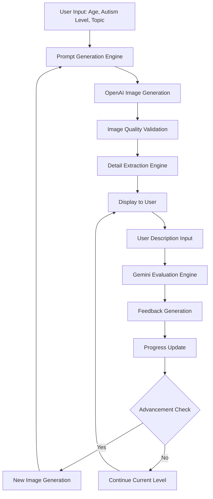
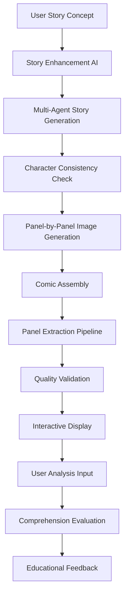

# VisoLearn-2: Code Handover Document

**Version:** 2.1.0
**Date:** 2025-7-22
**Document Purpose:** This document provides a comprehensive technical handover for the VisoLearn-2 project. It is intended for developers, system administrators, and future maintainers responsible for the deployment, maintenance, and extension of the platform.

---

## 1. Project Overview

VisoLearn-2 is an enterprise-grade, AI-powered educational platform designed to support children with Autism Spectrum Disorder (ASD). The platform leverages advanced AI models to create personalized and therapeutically effective visual learning experiences, focusing on communication skills, narrative understanding, and social development.

### 1.1. Mission & Philosophy

*   **Mission:** To use cutting-edge AI to create personalized, engaging, and effective visual learning experiences for children with ASD.
*   **Core Philosophy:** The platform is built on principles of personalized learning, evidence-based practices, a visual-first approach, progressive development with adaptive difficulty, and a supportive, autism-friendly environment.

### 1.2. Target Audience

*   **Primary Users:** Children with ASD (ages 3-18).
*   **Secondary Users:** Special education teachers, speech-language pathologists, occupational therapists, behavioral analysts, parents, and caregivers.

### 1.3. Key Features & Differentiators

*   **Dual-Mode Learning:** Combines an Image Description Practice module with a sequential Comic Story Generator.
*   **Advanced AI Integration:** Utilizes OpenAI GPT-4 for image generation and Google Gemini for text processing and evaluation.
*   **Automated Comic Analysis:** Employs computer vision to automatically extract and analyze panels from generated comic strips.
*   **Therapeutic Integration:** Incorporates evidence-based intervention strategies tailored to different support levels.
*   **Comprehensive Analytics:** Features a real-time dashboard for tracking user progress and providing detailed learning insights.
*   **Compliance & Certification:** The platform is designed to be compliant with major healthcare and educational standards, including HIPAA, FERPA, SOC 2 Type II, GDPR, and WCAG 2.1 AA.

---

## 2. System Architecture

The VisoLearn-2 platform is a multi-layered system designed for modularity and scalability.

### 2.1. Architectural Layers

The system consists of five primary layers, each with distinct responsibilities.

```
┌─────────────────────────────────────────────────────────────┐
│                    VisoLearn-2 Architecture                 │
├─────────────────────────────────────────────────────────────┤
│  Frontend Layer (Gradio + Custom CSS/JS)                   │
│  ├── Image Description Interface                           │
│  ├── Comic Story Generator Interface                       │
│  ├── Analytics Dashboard                                   │
│  └── Settings & Configuration                              │
├─────────────────────────────────────────────────────────────┤
│  Application Layer (Python)                                │
│  ├── Session Management                                    │
│  ├── State Management                                      │
│  ├── File Operations                                       │
│  └── Visualization Utils                                   │
├─────────────────────────────────────────────────────────────┤
│  AI Integration Layer                                       │
│  ├── OpenAI GPT-4 (Image Generation)                      │
│  ├── Google Gemini (Text Processing)                      │
│  ├── Custom Evaluation Engine                             │
│  └── Comic Analysis Pipeline                              │
├─────────────────────────────────────────────────────────────┤
│  Computer Vision Layer                                      │
│  ├── OpenCV Panel Detection                               │
│  ├── Image Processing (PIL/Pillow)                        │
│  ├── Quality Assessment                                   │
│  └── Layout Optimization                                  │
├─────────────────────────────────────────────────────────────┤
│  Data Layer                                                │
│  ├── Local File System                                    │
│  ├── Google Drive API                                     │
│  ├── Session Persistence                                  │
│  └── Analytics Storage                                    │
└─────────────────────────────────────────────────────────────┘```

### 2.2. Core Technologies

*   **Frontend:** Gradio 4.x, Custom CSS3, JavaScript (ES6+)
*   **Backend:** Python 3.8+, FastAPI (for API endpoints), Asyncio, Threading
*   **AI & Machine Learning:**
    *   **Image Generation:** OpenAI GPT-4 Vision
    *   **Text Processing:** Google Gemini 2.5 Flash
    *   **Evaluation:** Custom semantic matching and concept extraction engine
*   **Computer Vision:** OpenCV 4.x, Pillow, NumPy, Scikit-Image
*   **Data Storage:** Local file system, Google Drive API integration

### 2.3. Data Flow

#### Image Description Module Flow


#### Comic Story Generation Module Flow


### 2.4. Project File Structure

```
VisoLearn-2/
├── app.py                          # Main application entry point
├── config.py                       # Configuration settings and constants
├── models/                         # AI model integration modules
│   ├── comic_image_generator.py    # Comic generation and panel management
│   ├── evaluation.py               # Description evaluation and feedback
│   ├── image_generation.py         # OpenAI image generation integration
│   ├── prompt_generation.py        # Educational prompt creation
│   └── story_generation.py         # Story structure and narrative flow
├── 📁 ui/                             # User interface components
│   ├── interface.py                # Main Gradio interface definition
│   └── story_interface.py          # Comic story generator interface
├── 📁 utils/                          # Utility functions and helpers
│   ├── comic_panel_splitter.py     # Computer vision panel extraction
│   ├── file_operations.py          # File I/O and export functions
│   ├── state_management.py         # Session state handling
│   └── 📄 visualization.py            # UI visualization helpers
├── 📄 requirements.txt                # Python dependencies
├── 📄 .env.example                    # Environment variables template
├── 📄 .gitignore                      # Git ignore rules
└── 📄 README.md                       # Project README
```

---

## 3. Setup & Installation

### 3.1. Prerequisites

*   **OS:** Windows 10+, macOS 10.14+, Ubuntu 18.04+
*   **Python:** Version 3.8 or higher
*   **RAM:** 8GB recommended (4GB minimum)
*   **Storage:** 5GB+ free space
*   **Internet:** A stable internet connection is required for API calls to AI models.

### 3.2. Installation Steps

1.  **Clone the Repository:**
    ```bash
    git clone https://github.com/your-username/VisoLearn-2.git
    cd VisoLearn-2
    ```

2.  **Create and Activate a Virtual Environment:**
    ```bash
    # Create
    python -m venv venv

    # Activate (macOS/Linux)
    source venv/bin/activate

    # Activate (Windows)
    venv\Scripts\activate
    ```

3.  **Install Dependencies:**
    ```bash
    pip install --upgrade pip
    pip install -r requirements.txt
    ```

4.  **Configure Environment Variables:**
    *   Copy the example environment file: `cp .env.example .env`
    *   Edit the `.env` file and add your API keys. (See Section 4)

5.  **Verify Installation:**
    *   Run the API connectivity test script to ensure keys are configured correctly:
        ```python
        # [Info Needed: The README references a 'test_apis.py' script. Assuming it exists at the root.]
        python test_apis.py
        ```
    *   Launch the application to confirm it starts without errors.

---

## 4. Environment Variables / Secrets

The application requires API keys for AI services and other configuration settings, which are managed via a `.env` file.

| Variable | Description | Example |
| :--- | :--- | :--- |
| `OPENAI_API_KEY` | **Required.** Your API key for OpenAI services (GPT-4). | `sk-xxxxxxxxxxxxxxxxxxxxxxxx` |
| `GOOGLE_API_KEY` | **Required.** Your API key for Google AI services (Gemini). | `AIzaSyxxxxxxxxxxxxxxxxxxxxx` |
| `DEBUG` | Optional. Set to `True` for debug-level logging and development features. | `False` |
| `LOG_LEVEL` | Optional. Sets the application's logging level. | `INFO` |

---

## 5. How to Run

### 5.1. Starting the Application

Once installation is complete and the virtual environment is activated, run the following command from the project's root directory:

```bash
python app.py
```

The application will be accessible at a local URL, typically `http://127.0.0.1:7860`.

### 5.2. Basic Usage Workflow

1.  **Launch the application** and open the provided URL in a web browser.
2.  **Configure a session:** In the interface, select one of the two main modes:
    *   **Image Description Practice:** Set parameters such as child's age, autism support level, topic focus, and image style.
    *   **Comic Story Generator:** Provide a story concept, number of panels, and art style.
3.  **Interact with the AI:**
    *   For image practice, describe the generated image. The system provides real-time feedback.
    *   For the comic generator, analyze the generated story panel by panel or as a whole.
4.  **Manage Data:** Use the data management features to export session data, analytics, and reports to local storage or connected cloud services like Google Drive.

---

## 6. Deployment Instructions

The following guide details deploying the application to an AWS EC2 instance for a production environment.

### 6.1. EC2 Instance Setup

1.  **Launch Instance:** Use a `t3.large` instance or larger with Ubuntu 20.04 LTS. Ensure at least 8GB RAM and 20GB storage.
2.  **Install Dependencies:** Update the system and install Python, pip, venv, and required build tools.
    ```bash
    sudo apt update && sudo apt upgrade -y
    sudo apt install python3.10 python3.10-pip python3.10-venv build-essential libopencv-dev nginx -y
    ```
3.  **Deploy Application:** Clone the repository, create a virtual environment, and install dependencies as described in Section 3.
4.  **Configure `.env`:** Create and populate the `.env` file with production API keys.

### 6.2. Process Management with `systemd`

Create a service file to manage the application process.

1.  **Create the service file:**
    ```bash
    sudo nano /etc/systemd/system/visolearn.service
    ```
2.  **Add the following configuration:**
    ```ini
    [Unit]
    Description=VisoLearn-2 Application
    After=network.target

    [Service]
    Type=simple
    User=ubuntu
    WorkingDirectory=/home/ubuntu/VisoLearn-2
    Environment=PATH=/home/ubuntu/VisoLearn-2/venv/bin
    ExecStart=/home/ubuntu/VisoLearn-2/venv/bin/python app.py
    Restart=always
    RestartSec=10

    [Install]
    WantedBy=multi-user.target
    ```

### 6.3. Nginx Reverse Proxy

Set up Nginx to act as a reverse proxy, handle SSL, and serve the application.

1.  **Create Nginx configuration:**
    ```bash
    sudo nano /etc/nginx/sites-available/visolearn
    ```
2.  **Add the server block:**
    ```nginx
    server {
       listen 80;
       server_name your-domain.com;

       location / {
           proxy_pass http://127.0.0.1:7860;
           proxy_set_header Host $host;
           proxy_set_header X-Real-IP $remote_addr;
           proxy_set_header X-Forwarded-For $proxy_add_x_forwarded_for;
           proxy_set_header X-Forwarded-Proto $scheme;
       }
    }
    ```
3.  **Enable the site and configure SSL** (e.g., using Certbot for Let's Encrypt).

### 6.4. Start Services

Enable and start the application and Nginx services.

```bash
# Enable and start VisoLearn
sudo systemctl enable visolearn
sudo systemctl start visolearn

# Enable and start Nginx
sudo systemctl enable nginx
sudo systemctl restart nginx

# Check status
sudo systemctl status visolearn
```

---

## 7. Core Components & Logic

### 7.1. Main Application (`app.py`)

This is the main entry point that initializes the Gradio user interface and ties all the backend modules together. It loads the configuration and launches the web server.

### 7.2. Configuration (`config.py`)

This module centralizes all application settings. It loads secrets from the `.env` file and defines static configurations like available image styles, difficulty levels, and default therapeutic plans.

### 7.3. AI Models (`models/`)

This directory contains the core logic for interacting with AI services and implementing the platform's learning features.

*   `image_generation.py`: Handles communication with the OpenAI API to generate images based on dynamically created prompts.
*   `story_generation.py` & `story_agents.py`: A multi-agent system that creates coherent narrative structures and ensures character consistency for the comic generator.
*   `evaluation.py`: Contains the custom evaluation engine. It uses Google Gemini to analyze user descriptions, going beyond simple keyword matching to understand semantic meaning and track identified concepts.
*   `prompt_generation.py`: Constructs detailed, context-aware prompts for the AI models, tailored to the user's age, support level, and therapeutic goals.

### 7.4. User Interface (`ui/`)

This package defines the Gradio interface.

*   `interface.py`: Defines the main Gradio `Blocks` layout, connecting UI components (buttons, sliders, text boxes) to the backend functions in the `models` and `utils` packages.

### 7.5. Utilities (`utils/`)

This directory contains helper modules for various tasks.

*   `comic_panel_splitter.py`: Implements the computer vision pipeline using OpenCV to detect panel boundaries in a generated comic image and split it into individual scenes.
*   `file_operations.py`: Manages data export functionality, including saving sessions as JSON/CSV and generating PDF reports. It also handles Google Drive integration.
*   `state_management.py`: Manages the application's session state, ensuring user progress and settings persist across interactions within a session.

---

## 8. Third-party Dependencies

The project relies on several key third-party libraries. The complete list is available in `requirements.txt`.

*   **`gradio`**: For building the web-based user interface.
*   **`openai`**: The official Python client for the OpenAI API (image generation).
*   **`google-generativeai`**: The official Python client for the Google AI API (text processing and evaluation).
*   **`opencv-python`**: Used for computer vision tasks, primarily comic panel extraction.
*   **`Pillow`**: For image manipulation and processing.
*   **`numpy`**: For numerical operations, especially with image data.
*   **`python-dotenv`**: For managing environment variables from the `.env` file.

---

## 9. Testing Instructions

The project has a test coverage target of 85% and includes unit, integration, and performance tests. Development dependencies for testing must be installed first: `pip install pytest pytest-cov black flake8 mypy`.

### 9.1. Running Tests

To run the entire test suite, use `pytest`:

```bash
# Run all tests with verbose output
pytest -v

# Run tests with coverage report
pytest --cov=models --cov=utils --cov-report=html
```

### 9.2. Test Structure

*   **Unit Tests:** Focus on individual functions, such as prompt generation or API request formatting. These are designed to be fast and isolated.
    *   Example: `tests/test_image_generation.py` would test the `generate_image_fn` with various configurations and mock the API call.
*   **Integration Tests:** Test the complete workflow of a feature, such as a full image description-evaluation cycle or the entire comic generation pipeline.
    *   Example: `tests/test_integration.py` would call the image generation function, then pass the result to the evaluation function to ensure they work together correctly.
*   **Performance Tests:** Use `pytest-benchmark` to measure the execution time of critical functions like API calls and evaluation logic.

---

## 10. Troubleshooting & Common Issues

### 10.1. Common Problems

| Issue | Solution |
| :--- | :--- |
| **`ModuleNotFoundError`** on startup | The virtual environment is likely not activated. Run `source venv/bin/activate` (or `venv\Scripts\activate` on Windows). If that fails, reinstall dependencies with `pip install -r requirements.txt --force-reinstall`. |
| **API key not found / Authentication Error** | Ensure your `.env` file exists in the root directory and contains the correct, valid API keys for `OPENAI_API_KEY` and `GOOGLE_API_KEY`. |
| **Image generation fails with `RateLimitError`** | You have exceeded the rate limits of your OpenAI API plan. Wait before trying again or consider upgrading your plan. |
| **Comic panel extraction fails or is inaccurate** | This may be due to an issue with the OpenCV installation or an unusually complex generated image. Verify that `opencv-python` is installed correctly. |
| **Slow response times** | API calls to generative models can take time. If performance is consistently poor, check your internet connection and monitor system resources (RAM, CPU). Caching is implemented to mitigate this for repeated requests. |
| **Google Drive authentication fails** | The `token.pickle` file may be expired or corrupted. Delete it from the root directory and re-run the application. You will be prompted to go through the authentication flow again. |

### 10.2. Diagnostic Tools

A health check script is available to diagnose common configuration and connectivity issues.

```bash
# [Info Needed: Assuming a 'health_check.py' script exists as described in the README]
python health_check.py
```
This script will verify the Python version, check for missing dependencies, and test API connectivity.

---

## 11. TODOs / Future Work

The project has a detailed roadmap for future development.

### 11.1. Short-Term (Next 6 Months)

*   **Version 2.2 Release:**
    *   **Accessibility:** Implement voice interaction, improved screen reader support, and customizable sensory settings.
    *   **Therapeutic Modules:** Add new modules for social skills training and emotional regulation.
    *   **Analytics:** Introduce predictive analytics and an intervention recommendation engine.

### 11.2. Medium-Term (6-18 Months)

*   **Version 3.0 Release:**
    *   **Multi-language Support:** Add support for Spanish, French, Mandarin, and Arabic.
    *   **Collaboration:** Introduce real-time multi-user sessions and an educator dashboard.
    *   **Mobile Apps:** Develop native iOS and Android applications with offline capabilities.

### 11.3. Long-Term Vision (2025+)

*   **Advanced Personalization:** Develop a more sophisticated AI engine that adapts to each user's unique learning style in real time.
*   **VR/AR Integration:** Create immersive virtual reality experiences for social learning and sensory regulation.
*   **Research Platform:** Expand the platform into a comprehensive tool for large-scale intervention studies and global autism education research.

---

## 12. Contact / Ownership Info

*   **License:** The project is licensed under the **MIT License**. An additional **Educational Use Addendum** applies, granting priority and encouraging research collaboration for educational and therapeutic institutions.
*   **Core Contributors:** The project is maintained by a core development team and benefits from community contributions.
    *   [Info Needed: Primary technical contact/maintainer name and email.]
*   **Advisory Boards:** The project is guided by world-renowned experts on its Scientific, Clinical, and Technology Ethics advisory boards.
*   **Contribution:** Contributions are welcome. Please refer to the `CONTRIBUTING.md` file for guidelines on code style, testing, and the pull request process.